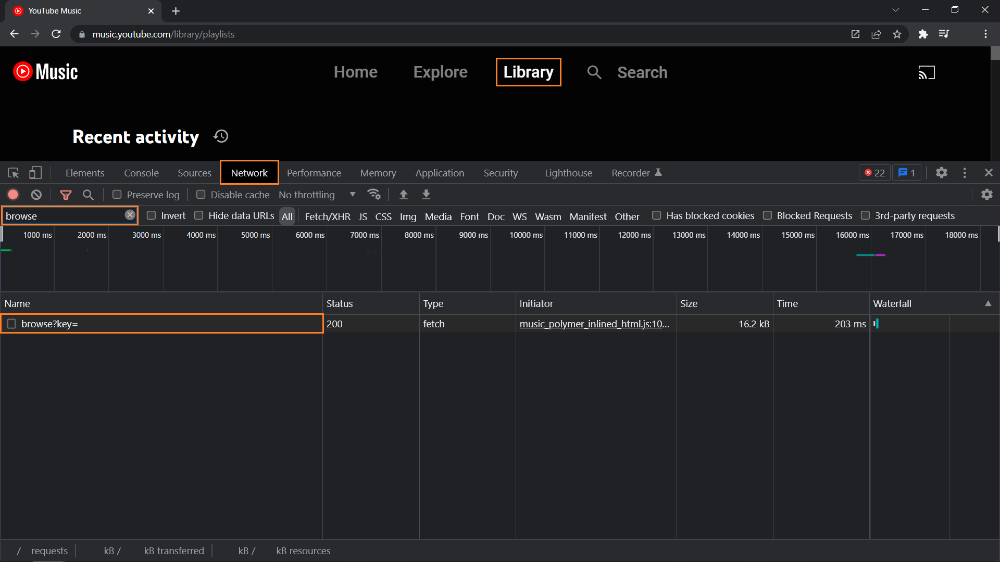
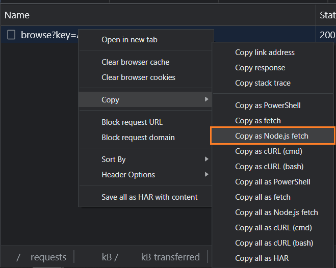

### Description

YouTube Music doesn't support backups. It also doesn't provide a public API. This repository helps you to download a list of your liked songs.

---

### Installation

Update the software.
```
sudo apt update && sudo apt upgrade -y
```

Install [`python`](https://www.python.org/) and [`pip`](https://pip.pypa.io/) (python package manager).
```
sudo apt install python3.8 python3-pip
```

Install [`virtualenv`](https://virtualenv.pypa.io/) (python environments manager).
```
pip3 install virtualenv && source ~/.profile
```

Clone this repository and cd into it.
```
git clone https://github.com/mrguseinov-backups/youtube-music.git && cd youtube-music
```

Create a new virtual environment and activate it.
```
virtualenv .venv && source .venv/bin/activate
```

Install the required packages.
```
pip install -r requirements.txt
```

Go to the [YouTube Music](https://music.youtube.com/) website and sign in. Press `F12` to open the [DevTools](https://developer.chrome.com/docs/devtools/), switch to the `Network` tab and navigate to the [Library](https://music.youtube.com/library/playlists) page. After filtering requests by `browse`, you should see something like the following:




Right click the `browse` request, then `Copy` and `Copy as Node.js fetch`.



Create the `headers.json` file in the project root, paste the copied content into it, and leave only the value from the `headers` key. You should end up with something like the following:

```json
{
    "accept": "...",
    "accept-language": "...",
    "authorization": "...",
    "content-type": "...",
    "sec-ch-ua": "...",
    "sec-ch-ua-arch": "...",
    "sec-ch-ua-bitness": "...",
    "sec-ch-ua-full-version": "...",
    "sec-ch-ua-full-version-list": "...",
    "sec-ch-ua-mobile": "...",
    "sec-ch-ua-model": "...",
    "sec-ch-ua-platform": "...",
    "sec-ch-ua-platform-version": "...",
    "sec-fetch-dest": "...",
    "sec-fetch-mode": "...",
    "sec-fetch-site": "...",
    "x-client-data": "...",
    "x-goog-authuser": "...",
    "x-goog-visitor-id": "...",
    "x-origin": "...",
    "x-youtube-client-name": "...",
    "x-youtube-client-version": "...",
    "cookie": "...",
    "Referer": "...",
    "Referrer-Policy": "..."
}
```

Note that the `headers.json` file must be kept secret.

---

### Usage

Activate the virtual environment if it's not active.
```
source .venv/bin/activate
```

Run the `app.py` file.
```
python app.py
```
